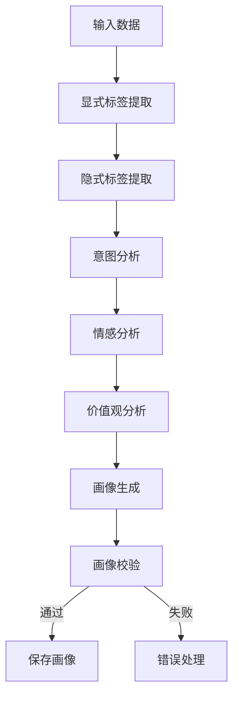

Ran tool
Read file: ai-workflow/src/core/intent_analysis.py
Read file: ai-workflow/src/core/profile_workflow.py
Read file: ai-workflow/src/core/sentiment_analysis.py
Read file: ai-workflow/src/core/tag_extraction.py
Read file: ai-workflow/src/core/user_segmentation.py
以下是对核心功能模块的详细解读及结构化文档，涵盖意图分析、画像主流程、情感分析、标签提取、用户分群五大核心模块，结合了你项目中的实际代码实现。

---

# 1. 意图分析（intent_analysis.py）

**主要类：**  
- `IntentAnalyzer`

**核心方法：**
- `analyze_user_intent(data: Dict[str, Any]) -> List[UserIntent]`  
  - 输入：用户数据（如搜索、浏览、对话、购买等历史）
  - 输出：用户意图列表（UserIntent）
  - 说明：目前为结构化框架，具体意图分析逻辑可根据业务需求扩展。支持多种行为类型的意图识别。

**典型应用场景：**
- 智能客服分流
- 推荐系统用户行为理解
- 用户需求预测

---

# 2. 用户画像主流程（profile_workflow.py）

**主要类：**  
- `UserProfileWorkflow`

**核心流程：**
- 采用有向图（StateGraph）方式组织画像生成流程，节点包括：
  1. 输入校验（validate_input）
  2. 显式标签提取（extract_explicit_tags）
  3. 隐式标签提取（extract_implicit_tags）
  4. 意图分析（analyze_intents）
  5. 情感分析（analyze_emotions）
  6. 价值观分析（analyze_values）
  7. 画像生成（generate_profile）
  8. 画像校验（validate_profile）
  9. 错误处理（error_handler）

- `generate_profile(user_id, input_data)`  
  - 输入：用户ID、原始数据
  - 输出：用户画像（UserProfile）
  - 说明：自动串联各分析模块，最终保存并返回用户画像。

**典型应用场景：**
- 用户画像自动生成
- 画像流程可视化与可扩展
- 业务流程自动化

---

# 3. 情感分析（sentiment_analysis.py）

**主要类：**  
- `SentimentAnalyzer`

**核心方法：**
- `analyze_user_emotions(data: Dict[str, Any]) -> List[UserEmotion]`  
  - 分析评论、产品评价等多源数据的情感倾向
- `analyze_user_values(data: Dict[str, Any]) -> List[UserTag]`  
  - 分析用户价值观、性格特征
- `analyze_multi_dimensional_sentiment(text: str, dimensions: List[str]) -> Dict[str, UserEmotion]`  
  - 针对不同维度（如产品、价格、服务等）进行情感分析

**典型应用场景：**
- 舆情监控
- 用户满意度分析
- 多维度情感洞察

---

# 4. 标签提取（tag_extraction.py）

**主要类：**  
- `TagExtractor`

**核心方法：**
- `extract_tags(data: Dict[str, Any], tag_type: TagType) -> List[UserTag]`  
  - 根据标签类型（显式/隐式）调用不同提取方法
- `_extract_explicit_tags(data)`  
  - 处理注册、问卷等结构化数据，提取人口统计、基础信息等标签
- `_extract_implicit_tags(data)`  
  - 处理文本、行为数据，进行NER实体识别、关键词、兴趣偏好等标签提取

**典型应用场景：**
- 用户兴趣建模
- 精准营销标签体系
- 内容推荐标签生成

---

# 5. 用户分群（user_segmentation.py）

**主要类：**  
- `UserSegmentationEngine`

**核心方法：**
- `create_intelligent_segments(users: List[UserProfile], segment_count: Optional[int]) -> List[UserSegment]`  
  - 支持LLM智能分群和机器学习（KMeans）分群两种方式
- `_extract_user_features(users)`  
  - 从用户画像中提取特征向量
- `_ml_based_segmentation(users, features, segment_count)`  
  - 标准化特征后用KMeans聚类
- `_llm_based_segmentation(users, strategy)`  
  - 通过大模型理解用户描述，智能分群

**典型应用场景：**
- 用户生命周期管理
- 精细化运营分层
- 群体特征洞察

---

# 6. 典型工作流示意

---

# 7. 总结

本系统核心模块各司其职，采用模块化、可扩展设计，支持多源数据融合、AI能力接入和自动化画像生成。每个模块均可独立优化，便于适配不同业务场景。

如需某个模块的详细代码逐行解读或用法示例，请告知具体模块和关注点！