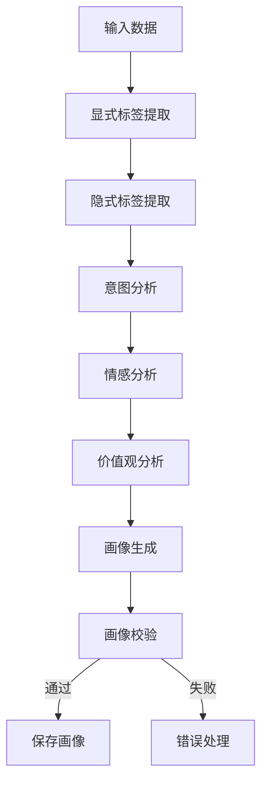

# 用户画像生成流程详解

本系统通过模块化的工作流自动生成用户画像，流程严谨、可扩展，具体如下：

---

## 一、整体流程概览

用户画像生成采用有向图工作流（StateGraph）方式，自动串联各分析与处理模块，主要步骤如下：

1. **输入校验**：检查用户ID和输入数据的有效性。
2. **显式标签提取**：从注册、问卷等结构化数据中提取人口统计、基础信息等标签。
3. **隐式标签提取**：对文本、行为数据进行NER实体识别、关键词、兴趣偏好等标签提取。
4. **意图分析**：分析用户的搜索、浏览、对话、购买等行为，识别用户意图。
5. **情感分析**：分析评论、反馈、产品评价等，识别用户情绪。
6. **价值观分析**：分析文本和性格数据，提取用户价值观和性格特征标签。
7. **画像生成**：整合所有标签、意图、情绪，生成用户画像对象。
8. **画像校验**：检查画像完整性、标签数量、置信度等，确保画像质量。
9. **错误处理**：流程中如有异常，统一进入错误处理节点。

---

## 二、关键代码逻辑与数据流

### 1. 工作流状态结构

```python
class ProfileWorkflowState(TypedDict):
    user_id: str
    input_data: Dict[str, Any]
    extracted_tags: List[UserTag]
    analyzed_intents: List[UserIntent]
    analyzed_emotions: List[UserEmotion]
    user_profile: UserProfile | None
    error_messages: List[str]
    workflow_status: str
    messages: Annotated[List, add_messages]
```

### 2. 主流程入口

```python
def generate_profile(self, user_id: str, input_data: Dict[str, Any]) -> UserProfile:
    # 初始化状态
    initial_state = ProfileWorkflowState(...)
    # 执行工作流
    final_state = self.workflow.invoke(initial_state)
    if final_state["workflow_status"] == "completed":
        save_user_profile(user_profile, user_id)
        return final_state["user_profile"]
    else:
        raise Exception(...)
```

### 3. 各节点功能说明

- **_validate_input**：校验用户ID和输入数据。
- **_extract_explicit_tags**：调用`TagExtractor`，从注册/问卷等结构化数据提取高置信度标签。
- **_extract_implicit_tags**：调用`TagExtractor`，对文本/行为数据做NER、关键词、兴趣等标签提取。
- **_analyze_intents**：调用`IntentAnalyzer`，分析用户行为意图。
- **_analyze_emotions**：调用`SentimentAnalyzer`，分析评论、评价等情绪。
- **_analyze_values**：调用`SentimentAnalyzer`，分析价值观和性格特征。
- **_generate_profile**：整合所有分析结果，生成`UserProfile`对象，并计算画像完整度。
- **_validate_profile**：校验画像质量，包括标签数量、完整度、置信度等。
- **_error_handler**：统一处理流程中出现的异常。

### 4. 画像完整度与质量校验

- **完整度计算**：
    - 标签类别覆盖率（覆盖的标签类别/总类别数）
    - 标签置信度均值
    - 综合得分 = 覆盖率×0.7 + 置信度均值×0.3
- **质量校验**：
    - 用户ID不能为空
    - 标签数量不少于3
    - 完整度不低于0.3
    - 低置信度标签不超过50%

---

## 三、数据流转示意



---

## 四、总结

本系统通过自动化、模块化的工作流，融合多源数据与AI能力，生成高质量、结构化的用户画像，支持灵活扩展与业务定制。 